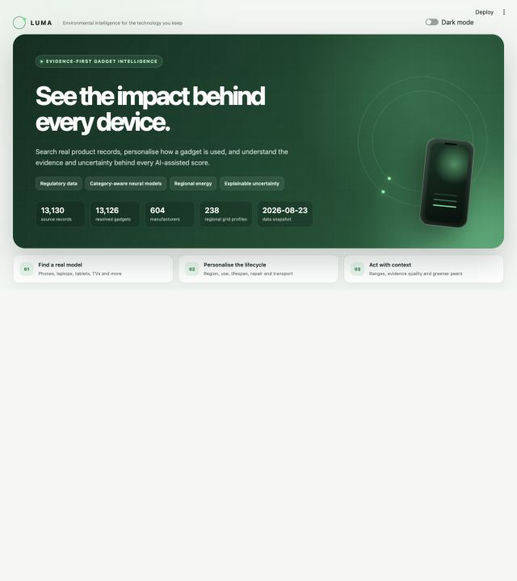
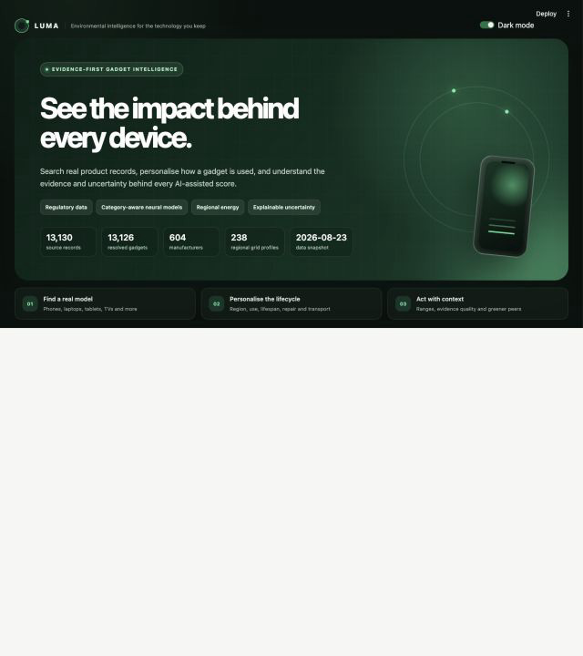

# Luma — Environmental Impact Analyser of Gadgets Using Deep Learning and AI

[](https://github.com/AryaPriyanshu/environmental-impact-analyzer/actions/workflows/ci.yml)

Luma v4.1 is an end-to-end environmental intelligence application for smartphones, laptops, tablets, TVs, monitors, desktops, printers, network equipment, watches, headphones, speakers, streaming devices and related electronics.

It combines current public product records, a transparent lifecycle ledger, a shadow-mode category-aware neural model, country-level electricity intensity and explicit uncertainty. Search accepts familiar retail names, technical identifiers, aliases and cautious typo matches across every category. If a device is not present, Luma preserves the name and produces a visibly labelled category or generic estimate instead of inventing model-specific facts.

## v4.1 milestone

Version 4.1 makes an assessment reproducible and makes comparisons more honest:

- Complete assessment links now carry the selected product or custom identity, every assessment input and explicit override, region, theme, source snapshot, model version, scoring version and scenario-schema version.
- The same versioned scenario can be downloaded as JSON and imported later. Whole shortlist projects also round-trip through a bounded versioned JSON bundle of validated scenarios.
- Comparisons apply one declared region, daily-use period and ownership period to every selected device. Likely-score intervals lead the view; overlapping intervals are labelled inconclusive, and mixed-purpose categories receive a warning.
- A field-level evidence ledger labels influential inputs as observed, calculated, estimated, regional/user scenario or scenario override, with source/date and the evidence that would improve each field.
- Keep, repair and replace guidance exposes one-year use carbon, a disclosed repair estimate, replacement production/freight and modeled carbon payback.
- Catalogue queries use SQLite FTS5/SQL candidates before the compatibility ranker, with literal and typo-recovery fallbacks instead of loading the complete record table for normal searches.
- Exact product lookup also uses the unique SQLite index. Separate liveness and readiness endpoints, route-template metrics (including unhandled failures), bounded API text fields, spreadsheet-safe CSVs, escaped PDF content and bounded scenario decoding harden production use.
- The neural model is governed in experimental shadow mode. It contributes diagnostics, applicability checks and an error component, but zero point-score weight until a real-LCA benchmark validates an improvement over the ledger.
- A missing, incompatible or per-request failing neural artifact degrades visibly to the deterministic ledger instead of taking the UI or assessment API down.

## What is included

- **13,130 traceable public-source records**, plus a reviewed identity manifest for product families missing from reusable lifecycle feeds
- **13,143 effective catalog records**, 13,139 resolved identities and 572 normalized manufacturer names in the bundled build
- Indexed global ranked search across all categories, with consumer aliases, spaced-name normalization, cautious typo recovery and spreadsheet-safe CSV export
- One-click assessment for any named device; unlisted products receive explicit category/generic assumptions and wider uncertainty
- Smartphone and tablet coverage from the EU EPREL regulatory registry
- Laptop, desktop, display, TV, printer and network-equipment energy records from ENERGY STAR
- French regulatory repairability data and iFixit teardown scores
- Apple and Samsung product environmental report values with links to the exact reports
- 298 brand/category repair profiles aggregated from 38,677 relevant Open Repair events
- Electricity carbon intensity for 238 countries and regions from Our World in Data / Ember
- Lifecycle dashboard covering manufacturing, use energy, lifespan, repairability, circularity/e-waste, battery and transport
- Transparent ledger point score plus a governed category-aware neural shadow model with per-category uncertainty calibration and applicability checks
- Greener-peer suggestions, shared-context comparison with uncertainty intervals, factor deltas, saved shortlists and PDF/CSV/JSON reports
- Complete versioned scenario links plus assessment and shortlist-project JSON import/export
- Field-level evidence ledger and keep/repair/replace carbon-payback guidance
- Responsive animated interface with persistent, accessible light and dark modes
- SQLite full-text catalogue, FastAPI service, liveness/readiness/metrics endpoints, Docker setup and automated refresh workflow
- API resolution endpoint returning candidates, category/manufacturer facets and an honest fallback descriptor

## Interface

Light and dark screenshots are generated during visual verification and stored in `docs/screenshots/`.

| Light | Dark |
|---|---|
|  |  |

The interface respects `prefers-reduced-motion`. Dark mode persists in session state and in `?theme=dark`, so shared views preserve the chosen appearance.

## Portable scenarios and projects

Every completed assessment can be reopened from a `?scenario=...` link or downloaded as a JSON file. Both representations use scenario schema **1** and preserve:

- catalogue `product_id` when one exists, or the custom name/manufacturer/category;
- all supported lifecycle inputs and the exact fields marked as user overrides;
- electricity region and intensity, interface theme and other assessment context;
- source snapshot, model version and scoring version.

Opening a link or importing an assessment JSON restores the controls. For a product still present in the current catalogue, its live row remains authoritative: only saved user context and fields explicitly recorded as overrides are overlaid, so stale or edited fallback values cannot impersonate current observations. If the product is absent, the bounded saved fallback snapshot is restored as a clearly labelled unlisted estimate. Luma warns when the saved source snapshot, model or scoring version differs from the running build. The PDF report prints the same scenario, data, model and scoring identifiers.

The URL token is zlib-compressed and URL-safe, includes a 128-bit integrity tag and is checked before decompression. The decoder rejects unsupported versions, unknown fields, duplicate JSON keys, non-finite or out-of-range values, malformed compression and oversized input. Application links use a checksum to detect corruption; this is not proof of who created a link. The serialization library also supports an optional HMAC key for deployments that require authenticated tokens. Never put secrets or personal data into a scenario.

The **Saved & reports** tab imports and exports both individual assessment JSON and whole shortlist projects. Project schema **1** contains the source snapshot and an array of scenario contracts—not trusted cached scores. Import accepts at most 1 MB and 50 scenarios, rejects duplicate/unknown/missing fields, non-finite numbers, unsupported versions and malformed UTF-8/JSON, then validates every nested scenario with the same strict scenario contract.

After project import, Luma resolves each scenario against the running catalogue, applies the same live-row/explicit-override trust boundary, and recomputes the score, interval, confidence and report fields with the current code. A snapshot/version warning makes drift visible; old derived display values are never trusted as current results. Shortlists otherwise live only in the current Streamlit session.

## Evidence, decisions and comparisons

The expanded evidence ledger shows the value, status, source, date and desired improvement for every influential input. An observed identity is not treated as observed lifecycle evidence, and changing a sourced energy, repair, battery or durability field invalidates that observation for the active scenario.

The keep/repair/replace panel is deliberately a decision aid:

- **Keep one more year** is use-phase carbon under the selected grid and usage.
- **Repair + one year** adds a disclosed repair footprint of 4–8% of manufacturing carbon, adjusted by repairability.
- **Replacement upfront** includes the candidate's modeled manufacturing and freight.
- **Carbon payback** divides new-production impact by annual use-phase savings; no savings means no modeled payback.

The replacement candidate is shown explicitly. These figures are not repair quotations, guaranteed savings or product LCAs.

Comparison accepts two to five catalogue records and recalculates them under one shared electricity region, daily active use and ownership period. Published annual-energy and lifecycle totals are intentionally set aside for this view so every device uses the same declared context. The view shows likely-score intervals, labels overlapping pairs as inconclusive, warns about cross-category comparisons and reports factor deltas against the highest point estimate. Confidence remains an evidence-coverage indicator, not a probability that one device is better.

## Data snapshot

The bundled source snapshot was generated on **2026-08-23**; the reviewed consumer-identity supplement was checked on **2026-08-24**. Run the refresh/build commands to regenerate the open-source data and derived search index.

| Source | Raw/relevant records | What is observed |
|---|---:|---|
| [ENERGY STAR Computers V9.0](https://data.energystar.gov/d/rxdj-2c88) | 1,788 | Identity, type, certification dates, TEC energy, battery where published |
| [ENERGY STAR Displays V8.0](https://data.energystar.gov/d/qbg3-d468) | 2,846 | Identity, display properties and measured on-mode power |
| [ENERGY STAR Televisions V9.x](https://data.energystar.gov/d/pd96-rr3d) | 180 | Identity, screen details, on-mode power and annual energy |
| [ENERGY STAR Imaging Equipment](https://data.energystar.gov/d/t2v6-g4nf) | 2,745 | Identity, equipment type, sleep/standby power and dates |
| [ENERGY STAR Large Network Equipment](https://data.energystar.gov/d/n8cx-m62r) | 96 | Enterprise router/switch identity and measured load power |
| [ENERGY STAR UPC crosswalk](https://data.energystar.gov/d/8edu-y555) | refreshed during sync | Retail UPC aliases linked to ENERGY STAR product IDs; no environmental claim added |
| [EU EPREL smartphones and tablets](https://eprel.ec.europa.eu/screen/product/smartphonestablets20231669) | 2,358 | Identity, energy class, repairability, durability, battery endurance/cycles and software support |
| [French Repairability Index](https://www.data.gouv.fr/datasets/fichiers-consolides-des-donnees-respectant-le-schema-indice-de-reparabilite) | 3,416 relevant | Submitted model identity and regulatory repairability score |
| [iFixit smartphone scores](https://fr.ifixit.com/reparabilite/indices-smartphone) | 155 | Model identity, release year and independent teardown score |
| Apple and Samsung product reports | 37 configurations | Report-specific cradle-to-grave carbon footprint; production share only when explicitly reported |
| [Open Repair Data](https://openrepair.org/open-data/downloads/) | 38,677 mapped events | Aggregated brand/category repair outcomes, product age and end-of-life barrier—not model identity |
| [Our World in Data / Ember](https://ourworldindata.org/grapher/carbon-intensity-electricity) | 238 latest regional profiles | Lifecycle carbon intensity of electricity in gCO₂e/kWh |

Normalized catalogue categories:

| Category | Records | Category | Records |
|---|---:|---|---:|
| Laptop | 4,530 | Monitor | 2,710 |
| Printer / scanner | 2,632 | Tablet | 1,370 |
| Smartphone | 1,155 | Desktop | 452 |
| Television | 180 | Router / network | 93 |
| Game console | 7 | Smartwatch | 3 |
| Spatial computer | 3 | E-reader | 3 |
| Speaker | 2 | Streaming device | 2 |
| Headphones | 1 |  |  |

Some categories have many regulatory records while others contain only reviewed manufacturer identities. Identity-only rows prove that a model exists but do not turn category assumptions into observations. Any other named gadget can still be assessed through the editable fallback flow.

### Provenance and entity resolution

Every catalogue row includes:

- a stable source-specific `product_id` and cross-source `entity_key`;
- original source name, URL, type, licence/terms and retrieval timestamp;
- observed-field flags for energy, repairability, carbon, battery, durability and software support;
- normalized manufacturer/model identity, evidence-source count and duplicate-group size;
- freshness and evidence-quality labels;
- explicit assumptions such as the 3.85 V conversion used when EPREL publishes battery capacity only in mAh.

Entity resolution groups complementary records but does not silently merge conflicting measurements. `is_primary_record` selects the strongest representative for search; all underlying evidence remains downloadable.

## Architecture

```text
ENERGY STAR ─┐
EU EPREL ────┤
France/iFixit├── sync + normalize + resolve ── official_gadgets.csv ── SQLite/FTS5
Product PDFs ┤                  │                         │                │
Open Repair ─┤                  ├─ repair_profiles.csv    │                ├─ FastAPI
OWID/Ember ──┘                  └─ grid_intensity.csv     │                └─ Streamlit UI
Reviewed identities + aliases ──────────────────────────┘        │
                                                                  ├─ exact/alias/fuzzy candidates
Any unlisted device name ── category inference + confirmation ────┘  └─ explicit fallback scenario

Selected or inferred device + declared context
                         │
             transparent lifecycle ledger ── point score + factors
                         │
              evidence/confidence model ───── likely interval
                         │
          scenario v1 token/JSON ──────────── share · reopen · report

Balanced scenario generator ── global MLP + category residual MLPs
                         │
                shadow prediction + applicability diagnostics
                         └── 0% point-score weight until real-LCA validation
```

### Scoring boundary

The v4.1 point estimate is the deterministic lifecycle ledger:

- manufacturing and materials: **35%**;
- energy during use: **22%**;
- lifespan and repairability: **18%**;
- circularity and e-waste: **13%**;
- battery: **8%**;
- transport: **4%**.

The final eco score is `100 − impact burden`; higher is greener. Manufacturer-reported lifecycle carbon is displayed when available, while the score still exposes the declared ledger factors. Otherwise lifecycle carbon is computed from manufacturing, electricity and transport assumptions.

The bundled metrics set `validated_for_real_lca` to `false`, so neural point-estimate blending is disabled. The guarded code path retains future caps of 28% for catalogue-backed evidence, 12% for identity/category estimates and 0% for generic `Other` devices, but those caps do not activate until the validation flag is supported by an external benchmark. Unlisted and weak-evidence assessments also receive lower confidence and wider intervals.

The displayed score interval combines the evidence-tier base range with the shadow model's holdout error, widened when inputs fall outside the training applicability domain. It is a sensitivity/uncertainty aid, not a calibrated probability or a guarantee that the true score falls inside it.

### Neural-model governance

There is no large, current, public dataset containing complete and comparable lifecycle labels for every gadget. Training therefore uses **15,997 reproducible physics-informed scenarios**:

1. sample each category evenly;
2. anchor available features to the current official-product distributions;
3. use declared category baselines where no model-level source exists;
4. perturb use, life, grid, freight and material assumptions within documented ranges;
5. train one global multi-layer perceptron and per-category residual MLPs;
6. choose category residual weights on validation data;
7. calibrate the displayed model range using the 90th-percentile absolute error on untouched holdout scenarios.

Current metrics on 3,200 held-out synthetic scenarios:

| Method | MAE | P90 absolute error | R² | Point-score role |
|---|---:|---:|---:|---|
| Deterministic ledger baseline | 1.871 | 3.840 | 0.969 | Current point estimate |
| Global + category neural blend | 2.113 | 4.272 | 0.960 | Experimental shadow only |

The ledger performs better on its own synthetic target in this build, so the neural model is not allowed to move the point score. It still returns its prediction, category calibration error and `inside`/`edge`/`outside` applicability status; out-of-domain inputs widen its error contribution.

These metrics measure reconstruction of a disclosed synthetic ledger target, **not agreement with measured, independently verified real-product LCAs**. Shadow promotion requires an external, representative real-LCA benchmark showing a defensible improvement over the ledger. Until that exists, neither the neural metrics nor the eco score establish product-level environmental truth. Global/category metrics, residual weights, ledger baseline, validation status and drift baseline are published in the UI, `models/metrics.json` and `/v1/data-quality`.

## Setup and run

Python **3.11** is recommended and matches CI and the container image.

```bash
git clone https://github.com/AryaPriyanshu/environmental-impact-analyzer.git
cd environmental-impact-analyzer

python3 -m venv .venv
source .venv/bin/activate
python -m pip install --upgrade pip
python -m pip install -r requirements-dev.txt
```

Run the Streamlit UI:

```bash
streamlit run app.py
```

Run the FastAPI service in another terminal:

```bash
source .venv/bin/activate
uvicorn api:app --reload --port 8000
```

Windows PowerShell activation:

```powershell
.venv\Scripts\Activate.ps1
python -m pip install --upgrade pip
python -m pip install -r requirements-dev.txt
streamlit run app.py
```

The committed data snapshot and trained model allow the UI to run offline after installation.

## Data, index, model, monitor and tests

Run the stages individually in this order when rebuilding derived assets:

```bash
# Fetch current public data, normalize fields and resolve entities
python src/sync_official_data.py

# Train global and category residual neural models
python src/train_model.py

# Build the indexed API catalogue
python src/database.py

# Run data freshness, snapshot alignment and distribution-drift checks
python src/monitor.py

# Verify calculations, exports, API, model and source integrity
python -m pytest -q
python -m compileall -q app.py api.py src tests
```

Useful focused checks:

```bash
# Scenario contract, safe exports and production hardening
python -m pytest -q tests/test_scenarios.py tests/test_exports.py tests/test_backend_hardening.py

# Ledger/model governance and applicability
python -m pytest -q tests/test_model_governance.py tests/test_production.py

# Run only the offline monitor; exits non-zero when a required check fails
python src/monitor.py
```

`src/monitor.py` writes `data/health_report.json` and checks snapshot age, model/snapshot alignment, required schema, source volumes, identifier uniqueness, one-primary-record-per-entity, category coverage and numeric distribution drift. Rebuilding the SQLite index writes a temporary database and atomically replaces `data/catalog.db` after a successful build.

The refresh uses public endpoints without a required secret. An officially issued EPREL bulk key can be passed as `EPREL_API_KEY`; never commit it. Copy `.env.example` for the supported environment variables.

The scheduled workflow in `.github/workflows/refresh-data.yml` runs monthly, rebuilds all derived assets, tests them, uploads a snapshot artifact and opens a reviewable pull request. A failed source or test leaves the existing committed snapshot untouched.

## API

Start the service:

```bash
uvicorn api:app --reload --port 8000
```

Interactive docs are available at `http://localhost:8000/docs`.

```bash
# Process liveness: 200 while the API process can answer
curl http://localhost:8000/health/live

# Deployment readiness: 200 only when the catalogue and snapshot-aligned model are ready
curl -i http://localhost:8000/health/ready

# Search primary gadget records
curl "http://localhost:8000/v1/gadgets?q=MacBook&limit=10"

# Resolve a familiar name or receive an explicit fallback descriptor
curl "http://localhost:8000/v1/resolve?q=Samsung%20Galaxy%20S25%2B"

# Assess an unlisted/future name using inferred, editable category assumptions
curl -X POST http://localhost:8000/v1/assess \
  -H "Content-Type: application/json" \
  -d '{"query":"iPhone 99 Future","grid_kg_co2_per_kwh":0.7054}'

# Run a custom regional scenario
curl -X POST http://localhost:8000/v1/assess \
  -H "Content-Type: application/json" \
  -d '{"name":"Scenario phone","category":"Smartphone","daily_hours":4,"grid_kg_co2_per_kwh":0.7054,"lifespan_years":5}'

# Prometheus-compatible process/request metrics
curl http://localhost:8000/metrics
```

Endpoints:

- `GET /health/live` — liveness only; does not inspect data/model dependencies
- `GET /health/ready` — readiness with `database_ready`, `model_ready`, artifact-load and snapshot-alignment details; returns 503 when not ready
- `GET /health` — readiness-aware compatibility alias
- `GET /v1/categories`
- `GET /v1/gadgets` — indexed search with category/manufacturer filters, pagination and primary-record control
- `GET /v1/resolve` — ranked/diversified candidates, facets and explicit category/generic fallback
- `GET /v1/gadgets/{product_id}`
- `POST /v1/assess` — assessment, evidence tier, uncertainty, shadow-model role and applicability diagnostics
- `GET /v1/data-quality` — snapshot, ledger/neural metrics, validation status and limitations
- `GET /metrics` — Prometheus text; request labels use route templates rather than user-supplied product IDs

Normal text queries retrieve candidates from the SQLite FTS5 index and then use the compatibility ranker. SQLite builds without FTS5 use a bounded literal SQL fallback, while cautious typo recovery scans lightweight identity columns before fetching complete matches. Empty browse views can still read the complete catalogue by design.

Assessment bodies reject unknown fields and bound identity text, numeric ranges and catalogue IDs. If the optional neural diagnostic cannot load or evaluate a request, the endpoint returns a ledger assessment with `method.model_role = "ledger_only"` and a machine-readable `method.model_status` instead of failing the request.

## Export and input safety

- CSV exports neutralize cells beginning with `=`, `+`, `-`, `@`, tab, carriage return or newline before adding a UTF-8 BOM. This prevents catalogue or custom text from becoming a spreadsheet formula when opened in Excel-compatible software.
- PDF reports escape user/source text before passing it to ReportLab markup and include the evidence table, limitations and version identifiers.
- Scenario tokens and JSON use explicit field allow-lists, numeric bounds, finite-number checks, duplicate-key rejection and compressed/uncompressed size limits. Project import adds a 1 MB/50-scenario boundary and revalidates every nested scenario. Corrupt integrity tags fail closed.
- API identity/query lengths, pagination, unknown fields and assessment ranges are validated. Metrics record route templates, not arbitrary product identifiers, and count unhandled 500 responses.
- `.dockerignore` excludes `.env`, Streamlit secrets, private-key formats, secret directories and credential JSON files. The image runs as a non-root user.

These controls reduce common import/export and deployment risks; they do not make arbitrary files or links trustworthy. Inspect provenance and use authenticated scenario tokens when a deployment needs sender authenticity.

## Containers and deployment

The [v4.1 release verification record](docs/release-verification-v4.1.md) describes the tested runtime, results and deployment boundary. CI runs both the Python suite and the same suite inside the production container; test-only packages are installed in a disposable container and do not change the release image.

Run the UI and API together:

```bash
docker compose up --build
```

- UI: `http://localhost:8501`
- API/docs: `http://localhost:8000/docs`

`Dockerfile` runs as a non-root user and defines a health check. `render.yaml` contains separate UI and API services for one-click Render deployment. Any container platform can use the same commands:

```bash
streamlit run app.py --server.address=0.0.0.0 --server.port=$PORT
uvicorn api:app --host 0.0.0.0 --port=$PORT
```

Restrict browser access to the API with `ALLOWED_ORIGINS`. No application secret is bundled.

## Version identifiers

Luma records independent versions because a UI release, scoring change, source refresh and trained artifact do not mean the same thing.

| Component | Bundled version | Where it is recorded |
|---|---|---|
| Product milestone | 4.1 | This release documentation |
| Scoring method | 4.1 | `SCORING_VERSION` in `src/utils.py`; scenario/PDF metadata |
| Scenario contract | Schema 1 / token prefix `luma-s1` | `src/scenarios.py`, share links and assessment JSON |
| Saved project envelope | Schema 1 | Shortlist project JSON |
| Neural artifact | 3.0 | Serialized model and `models/metrics.json` |
| Source-data schema | 3.0 | `data/source_metadata.json` |
| Source snapshot | `511869fd34bfc302` (2026-08-23) | Source metadata, database, model metrics and scenario metadata |
| Search index schema | 4.0 | SQLite metadata |
| FastAPI application | 4.1.0 | OpenAPI and health responses |
| Supported runtime | Python 3.11 | CI and Dockerfile |

A scoring/model/snapshot mismatch does not silently rewrite an imported scenario: the UI surfaces a warning and the exported JSON retains its original identifiers. API readiness also fails when the loaded model and catalogue snapshot do not align.

## Repository layout

```text
app.py                              responsive Streamlit product UI
api.py                              FastAPI search and assessment service
data/official_gadgets.csv           provenance-rich normalized snapshot
data/consumer_identities.csv        reviewed identity-only gaps and corrected variants
data/catalog.db                     indexed SQLite/FTS5 catalogue
data/grid_intensity.csv             latest country/region electricity profiles
data/repair_profiles.csv            Open Repair brand/category aggregates
data/source_metadata.json           schema, snapshot, source and quality report
data/health_report.json             generated monitoring result
data/gadget_training_scenarios.csv  reproducible balanced model scenarios
models/gadget_impact_pipeline.joblib global + category residual neural models
models/metrics.json                 holdout calibration and drift baseline
src/sync_official_data.py           source adapters, normalization and resolution
src/device_search.py                global ranking, aliases, typo recovery and fallback inference
src/train_model.py                  scenario generation, training and evaluation
src/modeling.py                     serializable category-aware model wrapper
src/utils.py                        ledger, confidence, ranges and recommendations
src/decisions.py                    keep/repair/replace and carbon-payback calculations
src/evidence.py                     field-level evidence and assumption ledger
src/scenarios.py                    bounded versioned token and JSON scenario contract
src/projects.py                     bounded shortlist project import/export contract
src/exporting.py                    spreadsheet-safe deterministic CSV export
src/database.py                     atomic SQLite/FTS5 build, indexed repository and readiness
src/reporting.py                    escaped branded PDF and evidence-table generation
src/monitor.py                      freshness/schema/source/snapshot/drift health checks
tests/                              lifecycle, scenario, evidence, decision, export, model, API and UI tests
.github/workflows/                  CI and monthly reviewable data refresh
```

## Limitations and responsible use

- Public coverage is uneven. A category with one manufacturer report does not represent the whole market.
- “Any device” means the app can build an explicit estimate for any name; it does not mean exact public measurements exist for every model ever sold.
- Complete global phone identity requires licensed feeds such as the GSMA Device Database; vendor pages do not provide a legally reusable universal bulk API.
- ENERGY STAR and EPREL records are certification/registry evidence, not full product LCAs.
- Manufacturer footprints use configuration-specific boundaries and geography and may not be directly comparable.
- Open Repair model identity was intentionally removed upstream because of quality concerns; this project only uses its brand/category aggregates.
- mAh-to-Wh conversion, freight, materials, recycling and lifespan assumptions can dominate incomplete records. They are visible and editable.
- Regional annual-average electricity intensity does not represent every local supplier, hour or marginal-generation effect.
- Confidence is an evidence-coverage indicator, not a statistical probability.
- Likely-score intervals combine evidence rules and synthetic-model error; they are not statistically validated intervals against real product LCAs. Overlap means the displayed ordering is inconclusive, while separation still does not prove product superiority.
- Shared-context comparison improves consistency but does not make unlike product categories functionally equivalent. It intentionally replaces published annual energy and lifecycle totals with the declared comparison context.
- Keep/repair/replace figures use simplified production, freight, repair and use-phase assumptions. They exclude price, failure probability, rebound effects and many repair-part or disposal pathways.
- The neural model is interpolation over a disclosed synthetic scenario system and remains shadow-only. No bundled representative real-LCA benchmark validates it for point scoring.
- Default share-link integrity detects accidental modification but does not authenticate the sender; HMAC requires a deployment-supplied key.
- Assessment and shortlist-project JSON support round-trip import/export, but imported project scores are intentionally recomputed and may change when the source snapshot, model or scoring version changes. In-session saved items are not server-side persistence.
- Results are educational decision support, not ISO 14040/14044-conformant LCAs, procurement declarations or regulatory disclosures.

## Licence

Project code is licensed under the repository `LICENSE`. Data remains subject to each linked source's licence and terms; those are retained in row-level fields and `data/source_metadata.json`.

## Author

Priyanshu Arya · [LinkedIn](https://www.linkedin.com/in/priyanshu-arya-408a10268/)
